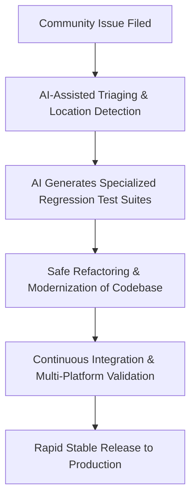

<p align="center">
  <a href="https://github.com/gauravmehta13/getxtra">
    
  </a>
</p>

<p align="center">
  <strong>A community-driven, AI-engineered, and high-velocity continuation of GetX. High-performance reactive state, context-free routing, and intelligent dependency injection—modernized for the next generation of Flutter.</strong>
</p>

<p align="center">
  <a href="https://pub.dev/packages/getxtra"></a>
  <a href="https://pub.dev/packages/getxtra/score"></a>
  <a href="https://pub.dev/packages/getxtra/score"></a>
  <a href="https://pub.dev/packages/getxtra/score"></a>
</p>

<p align="center">
  
  
  
  <a href="https://github.com/gauravmehta13/getxtra/actions"></a>
</p>

<p align="center">
  <a href="https://discord.com/invite/9Hpt99N"></a>
  <a href="https://communityinviter.com/apps/getxworkspace/getx"></a>
  <a href="https://t.me/joinchat/PhdbJRmsZNpAqSLJL6bH7g"></a>
</p>

---

## 🚀 The State of GetX 5.0 & The Path Forward

For years, GetX was the undisputed king of Flutter state management, beloved for decoupling business logic from views and eliminating context-dependent navigation. 

However, in mid-2026, the community hit critical, unresolved roadblocks:

### ⚡ The Core Roadblocks

* **🔴 Stalled Releases:** GetX 5.0 has remained in a perpetual release-candidate loop (`release-candidate-9.3.2`) for a very long time, leaving developers stranded in production with unreleased fixes.
* **🟠 Breaking SDK Upgrades:** Recent updates in Flutter 3.41+ & 3.44+ introduced hard compilation errors (such as the infamous `'CupertinoPageTransitionsBuilder' isn't a type` build error) and Dart 3.12+ compatibility failures.
* **🟡 Critical Platform Glitches:** Essential mobile routing APIs suffered from unpatched bugs:
  * `PopScope`'s `canPop` behaving incorrectly, causing broken back-swipe gestures on iOS.
  * Route transition animations freezing mid-screen under memory load.
  * `Get.bottomSheet` flashing white and dismissing instantly on iOS devices.
  * `Get.offAllNamed` leaking controller memory when routed from cold-start push notifications.

Instead of abandoning our codebases or initiating painful, costly rewrites in other state managers, we chose a better path: **we built the modernization ourselves.**

---

## 🎉 Introducing `getxtra`

**`getxtra`** is the community-driven, active evolution of GetX. Hosted at [gauravmehta13/getxtra](https://github.com/gauravmehta13/getxtra), it is a drop-in replacement that takes the core GetX 5.0 architecture and completely modernizes it for modern Flutter.

### ⚖️ The Comparison: Legacy vs. `getxtra`

| Core Metric | Legacy GetX 5.0 RC | `getxtra` (Modern Edition) |
| :--- | :---: | :---: |
| **Flutter 3.44+ / SDK compatibility** | ❌ Fails (Compile Errors) | 🟢 Fully Supported & Stable |
| **Dart 3.12+ Null Safety & Standards** | ❌ Outdated warnings | 🟢 100% Compliant & Warnings-free |
| **iOS Swipe Navigation Interception** | ❌ Broken / Freezes | 🟢 Re-engineered, smooth swipe gestures |
| **iOS Dynamic Bottom Sheets** | ❌ Visual flashing bug | 🟢 Solid, native-rendered animations |
| **Cold Notification Routing** | ❌ Memory leaks controllers | 🟢 Clean lifecycles, precise DI cleanup |
| **Publishing & Maintenance** | ❌ Stalled for years | 🟢 Community-run, ultra-high velocity |

### 🔍 Project Blueprint & Goals

1. **Preserve the API You Love:** Built directly on top of the **GetX 5.0 codebase**. Your imports and basic syntax remain unchanged. The transition is designed to be a drop-in replacement.
2. **Modernized Environment:** Ready out-of-the-box for **Dart 3.12+** and **Flutter 3.44+**. No more build-breaking Cupertino transition errors or deprecation warnings.
3. **Targeted Bug Fixes:** We have already addressed the core issues plaguing GetX 5.0:
   * Fixed `PopScope` / `canPop` navigation interceptors.
   * Resolved frozen route transition animations.
   * Fixed iOS bottom sheet flashing and auto-dismissal.
   * Corrected controller lifecycle management and routing edge cases for push notifications in `Get.offAllNamed`.

---

## 🤖 Powered by AI-Driven Development

Maintaining a full-scale reactive framework is a massive undertaking. To achieve unmatched velocity and safety, `getxtra` is developed using a cutting-edge approach: **AI-Driven Development**.

We leverage advanced AI models to accelerate framework maintenance:



* **Instant Issue Triaging:** Automatically maps user-reported bugs to exact source code coordinates.
* **Automated Test Harnesses:** Writes comprehensive unit and integration tests to secure iOS/Android gestures and platform lifecycles.
* **Safe Refactoring:** Automatically upgrades deprecated SDK hooks, preventing regressions and maintaining optimal performance.

Our AI-driven workflow translates to shipping robust, verified updates in **hours** instead of months.

---

## 🌱 The Fate of `getxtra` is Community-Driven

We want to be completely transparent: **this project’s survival depends entirely on you.**

* **If the community shows strong engagement**—by starring the repository, filing issues, providing feedback, and contributing pull requests—we will actively maintain `getxtra`, publish regular pub.dev updates, and keep it synchronized with future Flutter releases.
* **If interest is low**, it will remain a custom internal utility for our own production apps and will not be actively maintained for the public.

If you want a stable, modernized, and actively maintained version of GetX, **we need your voice (and your stars)!**

---

## 🛠️ How to Migrate & Get Started

Transitioning your app is exceptionally simple.

### 1. Update `pubspec.yaml`
Point your dependency directly to our community repository:

```yaml
# ● pubspec.yaml
dependencies:
  getxtra:
    git:
      url: https://github.com/gauravmehta13/getxtra.git
      ref: master
```

### 2. Update Import Statements
Replace any standard get references in your code:

```dart
// ● main.dart
import 'package:getxtra/get.dart';
```

---

## 📐 The Counter App: Power in 26 Lines

With `getxtra`, you separate your business logic from UI rendering cleanly, without stateful widgets or heavy boilerplate, in **just 26 lines of code**:

```dart
// ● main.dart
import 'package:flutter/material.dart';
import 'package:getxtra/get.dart';

void main() => runApp(GetMaterialApp(home: Home()));

class Controller extends GetxController {
  var count = 0.obs;
  increment() => count++;
}

class Home extends StatelessWidget {
  @override
  Widget build(context) {
    // Instantiate your controller and make it available to descendant routes
    final Controller c = Get.put(Controller());

    return Scaffold(
      appBar: AppBar(title: Obx(() => Text("Clicks: ${c.count}"))),
      body: Center(
        child: ElevatedButton(
          child: Text("Go to Other Screen"), 
          onPressed: () => Get.to(Other())
        )
      ),
      floatingActionButton: FloatingActionButton(
        child: Icon(Icons.add), 
        onPressed: c.increment
      ),
    );
  }
}

class Other extends StatelessWidget {
  // Retrieve the existing controller instance automatically
  final Controller c = Get.find();

  @override
  Widget build(context) => Scaffold(body: Center(child: Text("Count: ${c.count}")));
}
```

---

## 📚 Complete API & Features Guide

Click a category below to explore `getxtra`'s highly optimized core systems.

<details>
<summary><strong>⚡ Pillar 1: High-Performance State Management</strong></summary>

### 1. Reactive State Manager (Rx & Obx)
Reactive programming with `getxtra` completely removes streams, StreamControllers, and code generators.

Simply append `.obs` to make any variable observable:
```dart
// ● controller.dart
var name = 'Jonatas Borges'.obs;
var count = 0.obs;
var userList = <User>[].obs;
```

In the UI, wrap your widget in `Obx`. It will rebuild **only** when the specific observed values change:
```dart
// ● view.dart
Obx(() => Text("Hello, ${controller.name}"));
```

### 2. Simple State Manager (GetBuilder)
For ultra-lightweight, high-performance UI updates with zero stream overhead and negligible memory footprint, use `GetBuilder`.

```dart
// ● controller.dart
class Controller extends GetxController {
  int counter = 0;
  void increment() {
    counter++;
    update(); // Notifies and rebuilds listening GetBuilder widgets
  }
}

// ● view.dart
GetBuilder<Controller>(
  init: Controller(), // Instantiates the controller
  builder: (value) => Text('Count: ${value.counter}'),
)
```

> [!TIP]
> `GetxController` merges `RxController` and `GetBuilder` functionality. You can mix and match simple and reactive states inside the same class!
</details>

<details>
<summary><strong>🛣️ Pillar 2: Context-Free Route Management</strong></summary>

`getxtra` completely decouples navigation from the widget tree. Open snackbars, pop screens, and navigate to routes without ever passing a `BuildContext`.

### 1. Initialization
Simply swap your core `MaterialApp` widget for `GetMaterialApp`:
```dart
// ● main.dart
GetMaterialApp(
  home: MyHome(),
)
```

### 2. Navigation Control APIs
* **Navigate to a new page widget:**
  ```dart
  Get.to(NextScreen());
  ```
* **Navigate via Named Route:**
  ```dart
  Get.toNamed('/details');
  ```
* **Close dialogs, snackbars, bottom sheets, or pop the route:**
  ```dart
  Get.back();
  ```
* **Navigate to a new screen and remove the immediate previous route (e.g., Splash to Login):**
  ```dart
  Get.off(NextScreen());
  ```
* **Navigate to a new screen and clear the entire navigation history stack (e.g., Login to Dashboard):**
  ```dart
  Get.offAll(NextScreen());
  ```

### 3. Advanced Navigation
```dart
// Navigate and clean up history until a specific condition matches
Get.offUntil(DashboardScreen(), (route) => route.isFirst);

// Named routing equivalent
Get.offNamedUntil('/dashboard', (route) => route.isFirst);

// Manually remove a specific route from stack
Get.removeRoute(targetRoute);
```
</details>

<details>
<summary><strong>📦 Pillar 3: Intelligent Dependency Injection</strong></summary>

A highly optimized service locator is built directly into `getxtra`. Skip heavy architectures and retrieve logic files instantly.

### 1. Register a Dependency
Save a class instance inside the global memory space:
```dart
Controller controller = Get.put(Controller());
```

### 2. Retrieve the Dependency
Recover the registered instance from anywhere in your codebase:
```dart
Controller controller = Get.find();
```

### 3. Automated Lifecycle & Cleanup
`getxtra` is designed to be highly memory-efficient. When a screen is popped, its associated controller is automatically garbage-collected and disposed.
* **Keep dependency persistent:** Pass `permanent: true` to prevent automatic teardown:
  ```dart
  Get.put(Controller(), permanent: true);
  ```
* **Lazy Loading:** Load the class into memory *only* when it is actually called by `Get.find()`:
  ```dart
  Get.lazyPut<Service>(() => ServiceImpl());
  ```
</details>

<details>
<summary><strong>🌍 Internationalization & Localization Engine</strong></summary>

Manage translations with ease using lightweight key-value dictionary maps.

### 1. Configure Custom Translations
Extend the `Translations` class to setup multiple locales:
```dart
// ● translations.dart
import 'package:getxtra/get.dart';

class Messages extends Translations {
  @override
  Map<String, Map<String, String>> get keys => {
        'en_US': {
          'hello': 'Hello World',
          'logged_in': 'Logged in as @name',
        },
        'de_DE': {
          'hello': 'Hallo Welt',
          'logged_in': 'Eingeloggt als @name',
        }
      };
}
```

### 2. Output Translations in UI
* **Basic Translation:**
  ```dart
  Text('hello'.tr);
  ```
* **With Parameters:**
  ```dart
  Text('logged_in'.trParams({'name': 'Gaurav'}));
  ```
* **With Plurals:**
  ```dart
  Text('singularKey'.trPlural('pluralKey', itemCount, args));
  ```

### 3. Localization Settings
Configure `GetMaterialApp` with your translation maps:
```dart
GetMaterialApp(
  translations: Messages(),
  locale: Locale('en', 'US'),
  fallbackLocale: Locale('en', 'UK'),
)
```

Change active locales dynamically:
```dart
var locale = Locale('de', 'DE');
Get.updateLocale(locale); // All UI widgets using .tr rebuild instantly!
```
</details>

<details>
<summary><strong>🎨 Theme & Responsive Context Extensions</strong></summary>

Update dark/light themes instantly without boilerplate ThemeProviders or duplicate keys.

### 1. Dynamic Theme Controls
* **Switch to a custom theme:**
  ```dart
  Get.changeTheme(ThemeData.light());
  ```
* **Dark/Light Mode toggling:**
  ```dart
  Get.changeTheme(Get.isDarkMode ? ThemeData.light() : ThemeData.dark());
  ```

### 2. Rich Layout & Dimension Context Extensions
`getxtra` provides robust, high-performance extensions to read screen properties quickly:
```dart
// Immutable dimensions
Get.height // Double screen height
Get.width  // Double screen width

// Context-aware responsive mappings
context.responsiveValue<T>(
  watch: watchVal,
  mobile: mobileVal,
  tablet: tabletVal,
  desktop: desktopVal,
)

// Structural platform checks
context.isPhone()
context.isTablet()
context.isLandscape()
```
</details>

<details>
<summary><strong>🔌 GetConnect: REST Client & WebSockets</strong></summary>

An ultra-light REST client and WebSocket architecture that bypasses heavy network package dependencies.

### 1. Standard API Setup
```dart
// ● api_provider.dart
class UserProvider extends GetConnect {
  // GET request
  Future<Response> getUser(int id) => get('http://api.com/users/$id');

  // POST request
  Future<Response> postUser(Map data) => post('http://api.com/users', body: data);

  // File Upload
  Future<Response> uploadAvatar(List<int> image) {
    final form = FormData({
      'file': MultipartFile(image, filename: 'avatar.png'),
    });
    return post('http://api.com/users/upload', form);
  }
}
```

### 2. High-End Customization (Interceptors & Retries)
```dart
// ● api_provider.dart
class AdvancedProvider extends GetConnect {
  @override
  void onInit() {
    httpClient.baseUrl = 'https://api.com';
    httpClient.defaultDecoder = UserModel.fromJson;

    // Intercept outbound requests
    httpClient.addRequestModifier((request) {
      request.headers['Authorization'] = 'Bearer TOKEN';
      return request;
    });

    // Intercept incoming responses
    httpClient.addResponseModifier<UserModel>((request, response) {
      // Modify payload before UI delivery
      return response;
    });

    // Authenticator & Automatic recovery
    httpClient.addAuthenticator((request) async {
      final tokenRes = await get("http://api.com/token");
      request.headers['Authorization'] = "${tokenRes.body['token']}";
      return request;
    });
    httpClient.maxAuthRetries = 3;
  }
}
```
</details>

<details>
<summary><strong>🛡️ Advanced Routing Middleware Pipelines</strong></summary>

`GetPage` supports full middleware pipelines to intercept and validate route requests before screens build.

```dart
// ● routing.dart
GetPage(
  name: '/profile',
  page: () => ProfileView(),
  middlewares: [
    AuthMiddleware(priority: 1),
    AnalyticsMiddleware(priority: 2),
  ],
)
```

### 1. Build Custom Middleware
```dart
// ● auth_middleware.dart
class AuthMiddleware extends GetMiddleware {
  @override
  int priority = 1;

  @override
  RouteSettings redirect(String route) {
    final authService = Get.find<AuthService>();
    return authService.isAuthenticated.value 
      ? null 
      : RouteSettings(name: '/login');
  }
}
```

### 2. Middleware Hooks
* `onPageCalled`: Intercept the Page parameters before creation.
* `onBindingsStart`: Manipulate bindings list right before loading.
* `onPageBuildStart`: Execute code after loading bindings and before build.
* `onPageBuilt`: Capture the returned built page widget.
* `onPageDispose`: Execute tasks immediately upon page disposal.
</details>

<details>
<summary><strong>💻 Premium Helper Views (`GetView`, `GetResponsiveView`, `GetxService`)</strong></summary>

### 1. `GetView`
An elegant, stateless wrapper containing a direct getter for your registered controller, cutting down boilerplate lookup code:
```dart
// ● view.dart
class ProfileView extends GetView<ProfileController> {
  @override
  Widget build(BuildContext context) {
    // Access 'controller' instantly without lookup or declaration!
    return Text(controller.username);
  }
}
```

### 2. `GetResponsiveView`
Rapidly build robust interfaces tailored for mobile, tablet, and desktop viewports:
```dart
// ● view.dart
class HomeView extends GetResponsiveView<HomeController> {
  @override
  Widget? builder() {
    if (screen.isPhone) return PhoneLayout();
    if (screen.isTablet) return TabletLayout();
    return DesktopLayout();
  }
}
```

### 3. `GetxService`
A persistent, long-running service wrapper that **cannot** be auto-removed from memory, making it perfect for databases and cache engines:
```dart
// ● db_service.dart
class DatabaseService extends GetxService {
  Future<DatabaseService> init() async {
    // Perform SQLite or Hive setup
    return this;
  }
}
```
</details>

<details>
<summary><strong>🧪 Direct Unit Testing Harness</strong></summary>

Easily test controllers, network responses, and routing transitions without rendering widget trees.

```dart
// ● test/controller_test.dart
class Controller extends GetxController {
  final name = 'guest'.obs;
  void updateName(String newName) => name.value = newName;
}

void main() {
  test('Test reactive controller state', () {
    final controller = Controller();
    expect(controller.name.value, 'guest');

    // Register controller to trigger onInit hooks
    Get.put(controller); 
    controller.updateName('Gaurav');
    expect(controller.name.value, 'Gaurav');

    // Teardown
    Get.delete<Controller>();
  });
}
```

> [!IMPORTANT]
> Call `Get.reset()` at the end of each test inside your `tearDown` blocks to clean the global service locator state and prevent memory bleed across execution suites.
</details>

---

## 💬 Community Channels & Support

Collaborate, ask questions, and build the future of Flutter together:

* **Slack:** [Join the Workspace](https://communityinviter.com/apps/getxworkspace/getx)
* **Discord:** [Join the Server](https://discord.com/invite/9Hpt99N)
* **Telegram:** [Join the Chat](https://t.me/joinchat/PhdbJRmsZNpAqSLJL6bH7g)

---

## 🌱 Contribution

We welcome your stars, feedback, and pull requests! Let's keep the best parts of GetX modernized, robust, and community-powered. ⭐ **Star the repository** to make your voice heard!
